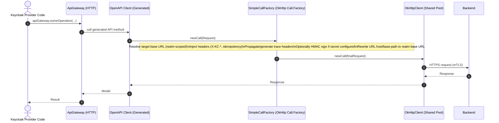

# Current: API Gateway HTTP Client

This is the request path for any backend call made via `ApiGateway` (devices, enrollment, approvals, SMS).

## Directed Graph

```mermaid
flowchart LR
  U[Actor (User)] -->|uses| C[Client]
  C -->|invokes| JS[JS (React native/React)]
  JS -->|HTTP to KC| KC[Keycloak]
  KC -->|executes| KCP[Keycloak Plugin]
  KCP -->|ApiGateway call| BE[Backend]
  BE -->|response| KCP
  KCP -->|response| KC
  KC -->|response| JS
  JS -->|renders| C
  C -->|result| U
```



Notes:
- Provider startup may happen with `session.context.realm == null`, so `HttpConfig` must be startup-safe.
- Realm-scoped base URL format is `BACKEND_HTTP_BASE_PATH_<realmName>` with fallback to `BACKEND_HTTP_BASE_PATH`.
- Connection reuse is achieved via a single shared `OkHttpClient` + `ConnectionPool`.
