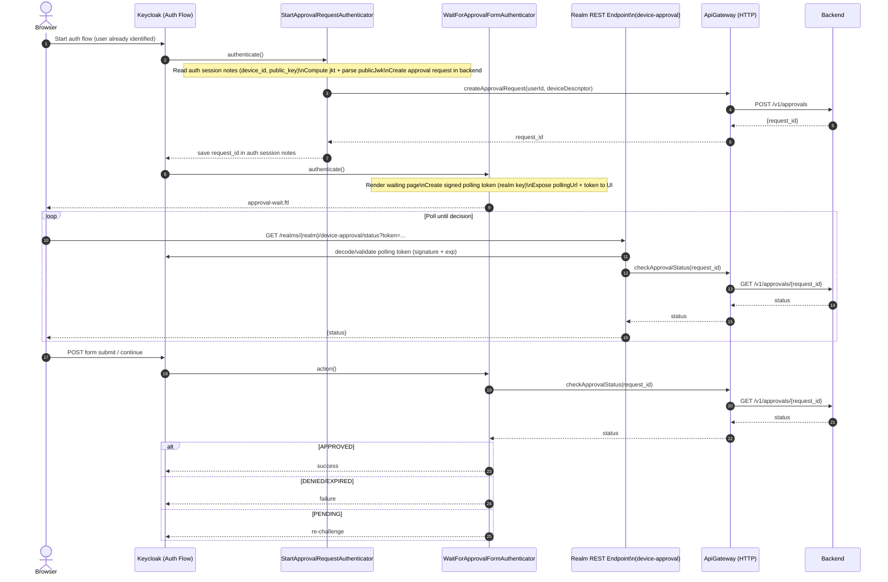

# Current: Approval Authenticators (New Device Approval)

This represents the approval branch implemented by `keycloak-keybound-authenticator-enrollment` plus the custom endpoint in `keycloak-keybound-custom-endpoint`.

## Directed Graph

```mermaid
flowchart LR
  U[Actor (User)] -->|attempts sensitive action| C[Client]
  C -->|runs| JS[JS (React native/React)]
  JS -->|starts auth/approval flow| KC[Keycloak]
  KC -->|runs approval authenticators| KCP[Keycloak Plugin]
  KCP -->|create + poll approval| BE[Backend]
  BE -->|approval status| KCP
  KCP -->|challenge/continue| KC
  KC -->|polling UI| JS
  JS -->|polls KC endpoint| KC
  KC -->|serves status| JS
  JS -->|renders| C
  C -->|approved/denied| U
```



Notes:
- The polling endpoint is Keycloak-local, but backend is the source of truth for approval status.
