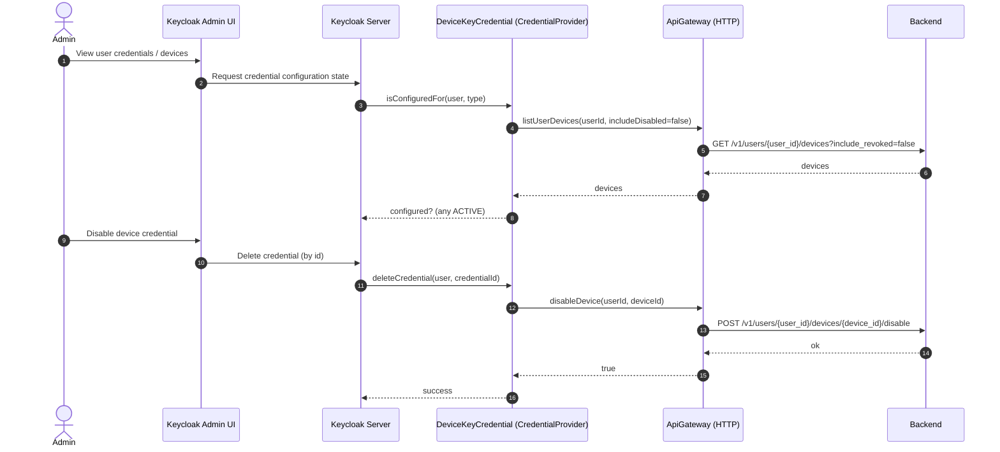

# Current: Credential Provider (Admin-Facing Device Credential)

This describes how the `device-key-credential-provider` behaves now that backend is the source of truth.

Scope:
- Reading: backend lookup/list is used.
- Deleting: translates to backend disable.
- Creating/updating: intentionally not supported via Keycloak credential APIs.

## Directed Graph

```mermaid
flowchart LR
  U[Actor (User)] -->|admin actions| C[Client]
  C -->|admin UI requests| KC[Keycloak]
  KC -->|calls| KCP[Keycloak Plugin]
  KCP -->|list/lookup/disable device| BE[Backend]
  BE -->|device records| KCP
  KCP -->|renderable state| KC
  KC -->|admin UI response| C
  C -->|admin sees changes| U
```



Notes:
- For admin display, Keycloak may call methods that assume local storage; this provider intentionally routes to backend.
