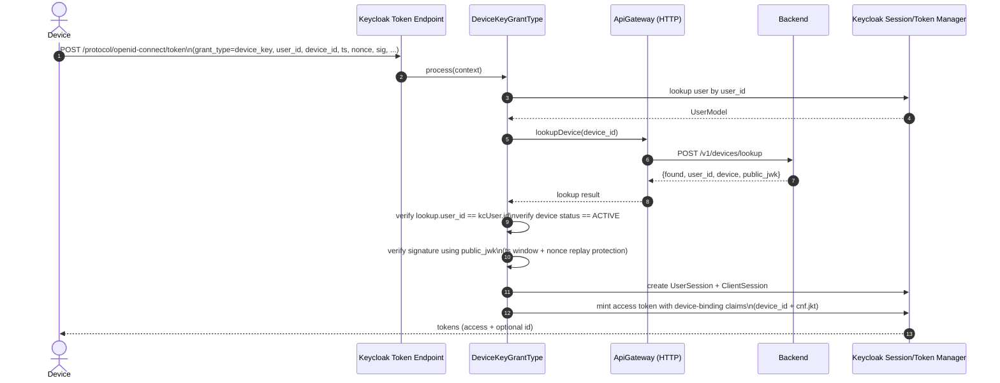

# Current: Device Key OAuth2 Grant Type

This is the `urn:ssegning:params:oauth:grant-type:device_key` flow implemented by `keycloak-keybound-grant-device-key`.

## Directed Graph

```mermaid
flowchart LR
  U[Actor (User)] -->|uses| C[Client]
  C -->|runs| JS[JS (React native/React)]
  JS -->|sign request (device key)| JS
  JS -->|token request| KC[Keycloak]
  KC -->|grant processing| KCP[Keycloak Plugin]
  KCP -->|lookup device + verify| BE[Backend]
  BE -->|public key + status| KCP
  KCP -->|tokens| KC
  KC -->|token response| JS
  JS -->|store tokens| C
  C -->|authenticated| U
```



Notes:
- Backend is authoritative for device binding, device status, and public key material.
- This custom grant is intended to be “access-token only” (no refresh token).
- The protocol mapper exists, but is not configured in the minimal dev realm import by default.
