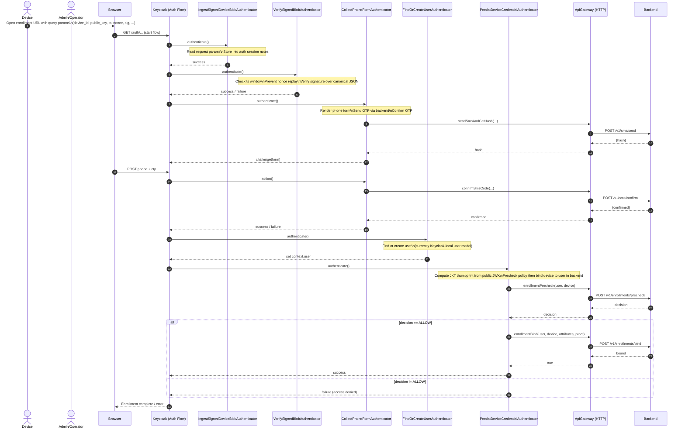

# Current: Enrollment Authenticators (Device Enrollment)

This represents the enrollment authentication flow implemented by `keycloak-keybound-authenticator-enrollment`.

Assumptions:
- A device constructs a signed blob containing at least `device_id`, `public_key` (JWK), `ts`, `nonce`, `sig`.
- Keycloak flow steps are modular authenticators.
- Device credential persistence is backend-first (Keycloak is not storing device credentials locally).

## Directed Graph

```mermaid
flowchart LR
  U[Actor (User)] -->|opens enrollment link| C[Client]
  C -->|runs| JS[JS (React native/React)]
  JS -->|generates keypair + signs blob| JS
  JS -->|sends enrollment request| KC[Keycloak]
  KC -->|runs authenticators| KCP[Keycloak Plugin]
  KCP -->|OTP + bind device| BE[Backend]
  BE -->|policy + bind result| KCP
  KCP -->|flow success/fail| KC
  KC -->|UI response| JS
  JS -->|show status| C
  C -->|status| U
```



Notes:
- Once the user-storage SPI is implemented, `FindOrCreateUserAuthenticator` can delegate to backend-backed users.
