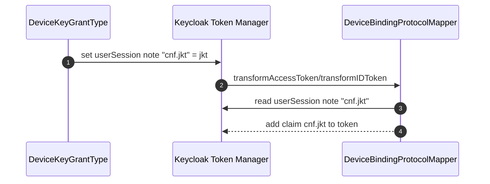

# Current: Protocol Mapper (cnf.jkt)

This describes the device-binding protocol mapper behavior.

## Directed Graph

```mermaid
flowchart LR
  U[Actor (User)] -->|uses| C[Client]
  C -->|runs| JS[JS (React native/React)]
  JS -->|token request| KC[Keycloak]
  KC -->|token minting| KCP[Keycloak Plugin]
  KCP -->|adds cnf.jkt claim| KC
  KC -->|token response| JS
  JS -->|store tokens| C
  C -->|authenticated| U
```



Notes:
- The mapper only decorates tokens; it does not validate devices.
