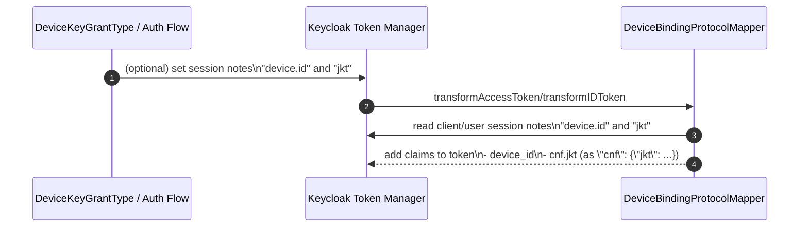

# Current: Protocol Mapper (Device Binding Claims)

This describes the device-binding protocol mapper behavior.

Important:
- Protocol mappers only run if they are configured on a client (or client scope).
- The minimal dev realm import (`.docker/keycloak-config/realm.theme.vymalo-wh-01.json`) does not configure this mapper by default, so it is usually not active unless you add it in the admin console.

## Directed Graph

```mermaid
flowchart LR
  U[Actor (User)] -->|uses| C[Client]
  C -->|runs| JS[JS (React native/React)]
  JS -->|token request| KC[Keycloak]
  KC -->|token minting| KCP[Keycloak Plugin]
  KCP -->|adds cnf.jkt claim| KC
  KC -->|token response| JS
  JS -->|store tokens| C
  C -->|authenticated| U
```



Notes:
- The mapper only decorates tokens; it does not validate devices.
- Current implementation reads notes named `device.id` and `jkt` (see `keycloak-keybound-protocol-mapper/src/main/kotlin/com/ssegning/keycloak/keybound/mapper/DeviceBindingProtocolMapper.kt`).
