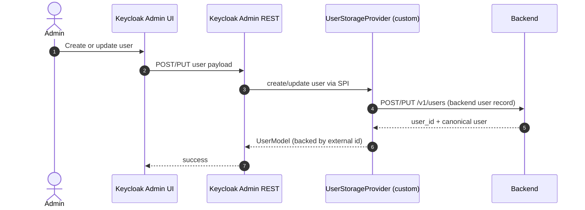
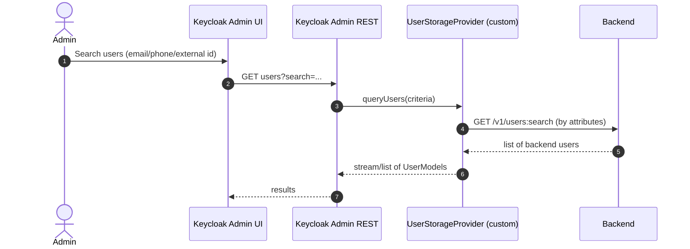
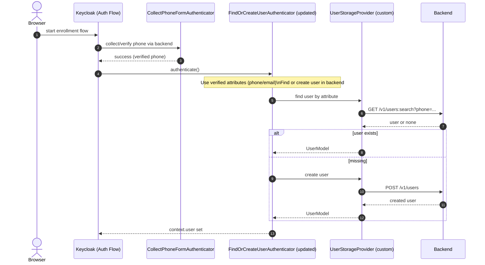

# Proposed: User Storage SPI (Backend-Backed Users)

Goal:
- Backend is the source of truth for users (create/update/(de)activate/query by id and by attributes).
- Keycloak is used for admin workflows, sessions, and token issuance, but resolves users through a User Storage Provider.

This document focuses on sequence diagrams; it does not prescribe exact Keycloak interfaces yet.

## Directed Graph

```mermaid
flowchart LR
  U[Actor (User)] -->|admin/operator| C[Client]
  C -->|admin actions| KC[Keycloak]
  KC -->|resolve/query users| KCP[Keycloak Plugin]
  KCP -->|User Storage SPI calls| BE[Backend]
  BE -->|user records| KCP
  KCP -->|UserModel + search results| KC
  KC -->|admin UI response| C
  C -->|admin sees users| U
```

## Admin: Create / Update User



## Admin: Query Users (Search by Attribute)



## Auth Flow: Find or Create User Using Backend

This shows how enrollment could evolve once users are backend-backed.



## Key Design Points (for implementation)

- Keycloak requires a `UserModel` for sessions/tokens; the provider must map backend `user_id` to Keycloak user identity consistently.
- For admin-only usage, the provider must support query/search efficiently (avoid full scans).
- Prefer an immutable external id (`backend_user_id`) and store it as the Keycloak “external id” or username mapping.
